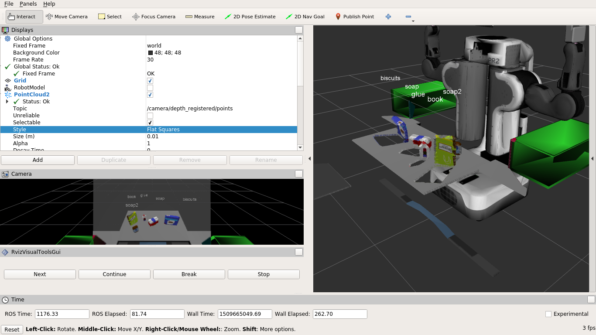

## Project: Perception Pick & Place

---
### Writeup

### Exercise 1, 2 and 3 pipeline implemented
#### 1. Exercise 1: Pipeline for filtering and RANSAC plane fitting implemented.

Exercise 1 was completed in repository [RoboND-Perception-Exercises](https://github.com/tiagoshibata/RoboND-Perception-Exercises/blob/master/Exercise-1/RANSAC.py). Screenshots:

Original point cloud:


Voxel grid filtered:


Pass through filtered:


RANSAC plane fitting inliers and outliers:


#### 2. Exercise 2: Pipeline including clustering for segmentation implemented.

The clustering and segmentation pipeline in ROS was completed, reusing most of the code from exercise 1, [and can be found here](https://github.com/tiagoshibata/RoboND-Perception-Exercises/blob/master/Exercise-2/sensor_stick/scripts/segmentation.py).

#### 3. Exercise 3: Features extracted and SVM trained.  Object recognition implemented.

Exercise 3 was implemented. [Capture of features](https://github.com/tiagoshibata/RoboND-Perception-Exercises/blob/master/Exercise-3/sensor_stick/scripts/capture_features.py) and [object recognition](https://github.com/tiagoshibata/RoboND-Perception-Exercises/blob/master/Exercise-3/sensor_stick/scripts/object_recognition.py) were implemented. The resulting confusion matrix is:


---

# Steps:
1. Extract features and train an SVM model on new objects.

Features were extracted and three models were trained. The `capture_features.py` script was changed to receive an argument that sets the list of labels to be used. The lists were taken from `pick_list_*.yaml` in `/pr2_robot/config/`:

```diff
diff --git a/Exercise-3/sensor_stick/scripts/capture_features.py b/Exercise-3/sensor_stick/scripts/capture_features.py
index a04164b..81ee745 100755
--- a/Exercise-3/sensor_stick/scripts/capture_features.py
+++ b/Exercise-3/sensor_stick/scripts/capture_features.py
@@ -2,6 +2,7 @@
 import numpy as np
 import pickle
 import rospy
+import sys

 from sensor_stick.pcl_helper import *
 from sensor_stick.training_helper import spawn_model
@@ -20,17 +21,54 @@ def get_normals(cloud):
     return get_normals_prox(cloud).cluster


+def get_labels(world_number):
+    if world_number == 0:
+        return [
+            'beer',
+            'bowl',
+            'create',
+            'disk_part',
+            'hammer',
+            'plastic_cup',
+            'soda_can',
+         ]
+    elif world_number == 1:
+        return [
+            'biscuits',
+            'soap',
+            'soap2',
+         ]
+    elif world_number == 2:
+        return [
+            'biscuits',
+            'soap',
+            'book',
+            'soap2',
+            'glue',
+         ]
+    elif world_number == 3:
+        return [
+            'sticky_notes',
+            'book',
+            'snacks',
+            'biscuits',
+            'eraser',
+            'soap2',
+            'soap',
+            'glue',
+         ]
+
+
 if __name__ == '__main__':
     rospy.init_node('capture_node')

-    models = [\
-       'beer',
-       'bowl',
-       'create',
-       'disk_part',
-       'hammer',
-       'plastic_cup',
-       'soda_can']
+    assert(len(sys.argv) <= 2)
+    if len(sys.argv) < 2:
+        world_number = 0
+    else:
+        world_number = int(sys.argv[1])
+
+    models = get_labels(world_number)

     # Disable gravity and delete the ground plane
     initial_setup()
```

The training sets were generated just like in exercise 3.

[The project's code can be found here.](pr2_robot/scripts/object_recognition.py) A ROS node was written to subscribe to `/pr2/world/points` topic. The data was filtered and passed through RANSAC plane fitting to remove the table from the scene. Euclidean clustering was applied to separate clusters for individual items.

Then, object recognition with a SVM was performed for each object and labels were displayed in rviz:

```python
for index, pts_list in enumerate(clusters):
    pcl_cluster = objects_cloud.extract(pts_list)
    ros_cluster = pcl_to_ros(pcl_cluster)

    # Extract histogram features
    color_histogram = compute_color_histograms(ros_cluster, using_hsv=True)
    normals = get_normals(ros_cluster)
    nhists = compute_normal_histograms(normals)
    feature = np.concatenate((color_histogram, nhists))

    # Prediction
    prediction = clf.predict(scaler.transform(feature.reshape(1, -1)))
    label = encoder.inverse_transform(prediction)[0]
    detected_objects_labels.append(label)

    # Publish a label into RViz
    label_pos = list(point_cloud[pts_list[0]])
    label_pos[2] += .4
    object_markers_pub.publish(make_label(label, label_pos, index))

    detected_object = DetectedObject()
    detected_object.label = label
    detected_object.cloud = ros_cluster
    detected_objects.append(detected_object)

rospy.loginfo('Detected {} objects: {}'.format(len(detected_objects_labels), detected_objects_labels))
detected_objects_pub.publish(detected_objects)

try:
    pr2_mover(detected_objects)
except rospy.ROSInterruptException:
    pass
```

The messages' data was saved to YAML files for [submission with the writeup and can be found here](models/).




# Extra Challenges: Complete the Pick & Place

I also completed some of the extra challenges. I didn't bother adding collision map support since I was running late with this assignment. However, as instructed by Udacity, it could be easily added by "publishing a point cloud to the `/pr2/3d_map/points` topic and changing the `point_cloud_topic` to `/pr2/3d_map/points` in `sensors.yaml`. This topic is read by Moveit!, which uses this point cloud input to generate a collision map, allowing the robot to plan its trajectory".

I created the messages to be sent to the pick_place_routine service and tested it. A `run_pick_place` variable controls whether pick and place operation is enabled:

```python
def pr2_mover(detected_objects):
    global has_collision_map
    labels = []
    test_scene_num = Int32()
    arm_name = String()
    object_name = String()
    place_pose = Pose()
    pick_pose = Pose()
    yaml_output = []

    object_list_param = rospy.get_param('/object_list')
    dropboxes = rospy.get_param('/dropbox')

    if run_pick_place:
        if not has_collision_map:
            has_collision_map = True
            for angle in [3.14 / 2, 0, -3.14 / 2, 0]:
                rotation_pub.publish(angle)
                rospy.sleep(8)

    world = world_number(object_list_param)
    test_scene_num.data = world
    for i, obj in enumerate(detected_objects):
        object_name.data = str(obj.label)
        object_group = next(x['group'] for x in object_list_param if x['name'] == obj.label)
        labels.append(obj.label)
        points_arr = ros_to_pcl(obj.cloud).to_array()
        centroid = np.mean(points_arr, axis=0)[:3]

        pick_pose.position.x, pick_pose.position.y, pick_pose.position.z = (
            np.asscalar(x) for x in centroid)
        group_info = {
            'red': {
                'arm': 'left',
                'place_position': dropboxes[0]['position'],
            },
            'green': {
                'arm': 'right',
                'place_position': dropboxes[1]['position'],
            },
        }
        group = group_info[object_group]
        arm_name.data = group['arm']
        place_pose.position.x, place_pose.position.y, place_pose.position.z = group['place_position']

        yaml_output.append(make_yaml_dict(test_scene_num, arm_name, object_name, pick_pose, place_pose))

        if run_pick_place:
            rospy.wait_for_service('pick_place_routine')
            try:
                pick_place_routine = rospy.ServiceProxy('pick_place_routine', PickPlace)
                resp = pick_place_routine(test_scene_num, object_name, arm_name, pick_pose, place_pose)
                print("Response: ", resp.success)
            except rospy.ServiceException as e:
                print("Service call failed: {}".format(e))

    print('YAML output: {}'.format(yaml_output))
    send_to_yaml('output.yaml', yaml_output)
```


After picking, the robot carries the item to the box and drops it on top of the box. With the basic solution of dropping in the specified position and without a collision map, the items would stack or the robot would hit them and let them fall out of the table. The solution wasn't good without collision maps, but at least I could watch the robot plan a trajectory from the object to the box. I was satisfied enough with my work and didn't work on improvements.

Furthermore, the provided code would sometimes not grab the item when using the Continue button or pressing Next too fast, making the robot move with empty hands. In the following screenshots, the robot fails to lift the object and moves with an empty hand:


## [Rubric](https://review.udacity.com/#!/rubrics/1067/view) Points
### Here I will consider the rubric points individually and describe how I addressed each point in my implementation.

### Improvements

The optional part of the project was not finished and has a lot of space for improvement. Collision maps should be built to allow the robot to dodge other objects when planning trajectories.

The SVM classifier could also be optimized. I didn't optimize it for accuracy, keeping it simple and with default settings, only changing the color space to HSV. I could fiddle with the histogram and SVM settings to achieve better accuracy.
